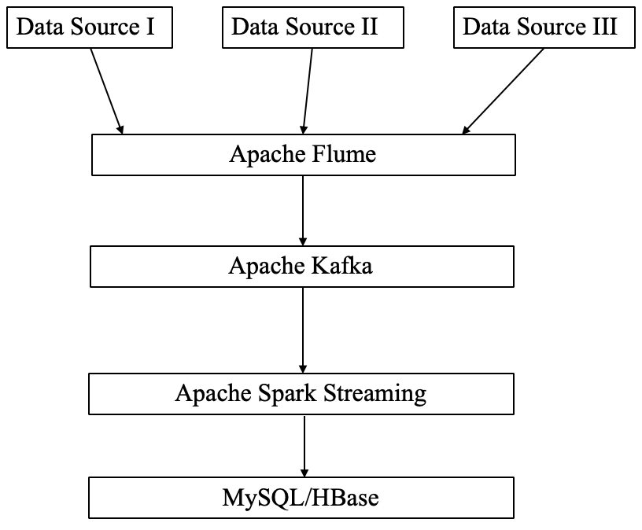

# Yimin Wang's project report for CSCI653
# Project: Real-time data stream processing
## Goal
Nowadays the topic of Big Data is trending dramatically since large amount of data is generated every day, even every second in various companies. Among all the industrial problems related to Big Data, how to process real-time big-data stream  is a difficult however important one to be solved. Streaming data is continuously generated by different sources and needs to be processed incrementally by the tecniques of stream processing.

For example, an ecommerce retailer may collect large amount of data generated by customers' shopping and surfing activities. When one customer is surfing on the website and hesitating to purchase something. If the real-time engine can collect data of his activity data and also other users' data in the same region or with similar shopping habit and push the fresh data to the recommendation system, it could make analysis and give correctly incentiving recommendations or compelling offers to the customers who are surfing online based on their current activities and shopping history and profile and finally customers will probably finalize their purchase.[1] Also, airline traffic control system requires to process large amounts of real-time data timely. Otherwise, serious accidents may occur due to long delay of processing data.[2] Based on the two industrial examples, we can see that achieving real-time data stream processing can make profits and avoid accidents.

## Specific objectives
The following picture shows how to process streaming data step by step. 
(1) New data is generated by difference data sources.
(2) A distributed data service is used to collect, aggregate and move those data.
(3) A distributed messaging system is used to store and process the data temporarily to decouple data collector and streaming processing part. We choose to add another layer between data collector and streaming process service because we want to avoid data loss due to inconsistency of the data processing speed of the two layers.
(4) A distributed streaming process service is used to process streaming data and do some map-reduce operations.
(5) A database will store all processed data results to later analysis.

## Current state of the knowledge/previous work
In the picture above, the whole process is divided into different core part. I will talk about each part repectively.

(1) Data collector
Currently, Apache Flume is the most famous service for transforming large amount of streaming data. Apache Flume is a distributed, reliable, and available service for efficiently collecting, aggregating, and moving large amounts of log data designed based on streaming data flows. [3]

(2) Messaging system
Currently, there are multiple messaging system services used in the world, such as Apache Kafka and RabbitMQ. In our project, we prefer to use Apache Kafka due to its high performance and wide application. It was originally developed by LinkedIn and endorsed by Apache Community. Apache Kafka can be used to publish and subscribe to streams of data, similar to a message queue or enterprise messaging system.[4] 

(3) Streaming processing service
Spark Streaming is one of the most widely used open-source streaming processing service. It is an extension of the principle Spark API enabling high-throughput and fault-tolerant stream processing of real-time data streams. Data can be ingested from many sources like Kafka, Flume, and can be processed using some high-level functions like map, reduce, join and window. And processed data can be pushed out to external databases.[5] 

(4) Database
MySQL is an open-source relational database management system (RDBMS). There are many types of NoSQL databases in the world. In this project, we choose to use Apache HBase due to its high integration with Hadoop file systems and being highly suitable when real-time and random read/write access to huge volumes of data are required.

# Techniques to be used
Actually in the part above, we already talked about what technique should be used for each part. All the techniques chosen for this project are already used widely in some big software companies and proven to be very stable and with high performance due to their scalability and fault-tolerance. All the four open-source frameworks or services used for this project are developed by Apache community.

# Results
In this project, we randomly generate some fake data of users' surfing activity for viewing course pages in a fake online education website. Every entity of data consists of user ID, timestamp, courseID and purchase status. One fake data source is used to generate large amound of data.

## Reference
[1] https://www.scnsoft.com/blog/real-time-big-data-analytics-comprehensive-guide

[2] https://www.bmc.com/blogs/batch-processing-stream-processing-real-time/

[3] https://flume.apache.org;

[4] https://kafka.apache.org/intro;

[5] https://spark.apache.org/docs/latest/streaming-programming-guide.html#overview.

