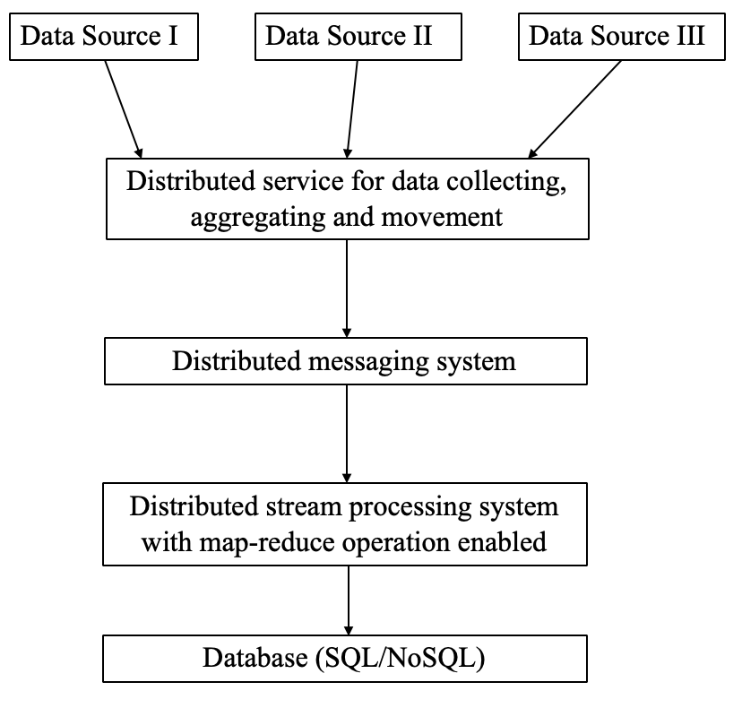
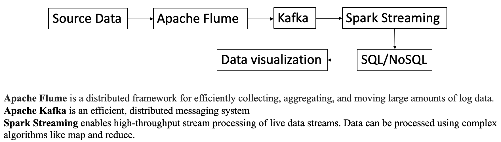

# Summary report for CSCI653 - Real-time data stream processing
## Name: Yimin Wang

# Goal
Nowadays the topic of Big Data is trending dramatically since large amount of data is generated every day, even every second in various companies. Among all the industrial problems related to Big Data, how to process real-time big-data stream  is a difficult however important one to be solved. Streaming data is continuously generated by different sources and needs to be processed incrementally by the tecniques of stream processing.

For example, an ecommerce retailer may collect large amount of data generated by customers' shopping and surfing activities. When one customer is surfing on the website and hesitating to purchase something. If the real-time engine can collect data of his activity data and also other users' data in the same region or with similar shopping habit and push the fresh data to the recommendation system, it could make analysis and give correctly incentiving recommendations or compelling offers to the customers who are surfing online based on their current activities and shopping history and profile and finally customers will probably finalize their purchase.[1] Also, airline traffic control system requires to process large amounts of real-time data timely. Otherwise, serious accidents may occur due to long delay of processing data.[2] Based on the two industrial examples, we can see that achieving real-time data stream processing can make profits and avoid accidents.

# Specific objectives
The following picture shows how to process streaming data step by step. 
(1) New data is generated by difference data sources.
(2) A distributed data service is used to collect, aggregate and move those data.
(3) A distributed messaging system is used to store and process the data temporarily to decouple data collector and streaming processing part.
(4) A distributed streaming process service is used to process streaming data and do some map-reduce operations.
(5) A database will store all processed data results to later analysis.

# Current state of the knowledge/previous work
In the picture above, the whole process is divided into different core part. I will talk about each part repectively.

(1) Data collector
Currently, Apache Flume is the most famous service for transforming large amount of streaming data. Apache Flume is a distributed, reliable, and available service for efficiently collecting, aggregating, and moving large amounts of log data designed based on streaming data flows. [3]

(2) Messaging system
Currently, there are multiple messaging system services used in the world, such as Apache Kafka and RabbitMQ. In our project, we prefer to use Apache Kafka due to its high performance and wide application. It was originally developed by LinkedIn and endorsed by Apache Community. Apache Kafka can be used to publish and subscribe to streams of data, similar to a message queue or enterprise messaging system.[4]

# Process

To meet all requirements about big data processing, many useful and powerful big data softwares and tools are devevloped and open-sourced by famous companies so that we can use them to meet most basic requirements. Currently, Apache Hadoop is still a powerful tool to maintain a highly distributed file system (HDFS) with Yarn to control resource management and job scheduling. Many other open-source software are built on top of Hadoop. For exmaple, Apache Spark is a cluster-computing framework which is compatible with Hadoop data through Yarn and it dramatically improves the performance of Map-Reduce. Also, Spark Streaming is a powerful tool to process data streaming.

# Techniques to be used

# Expected results
With so many powerful open-source big data tools, framework and software available, I plan to do website activiy log processing system using Hadoop, Spark, Kafka and so on so that the system can finish off-line query and process data streaming efficienty. That is my initial plan for my CSCI 653 project. I may add more contents with the development of this project.

## Flume, Kafka and Spark Streaming

Spark Streaming: an extension of the core Spark API that enables scalable, high-throughput, fault-tolerant stream processing of live data streams. Data can be ingested from many sources like Kafka, Flume, Kinesis, or TCP sockets, and can be processed using complex algorithms expressed with high-level functions like map, reduce, join and window. Finally, processed data can be pushed out to filesystems, databases, and live dashboards. In fact, you can apply Spark’s machine learning and graph processing algorithms on data streams.[3]

# Reference
[1] https://www.scnsoft.com/blog/real-time-big-data-analytics-comprehensive-guide

[2] https://www.bmc.com/blogs/batch-processing-stream-processing-real-time/

[3] https://flume.apache.org;

[4] https://kafka.apache.org/intro;

[5] https://spark.apache.org/docs/latest/streaming-programming-guide.html#overview.

